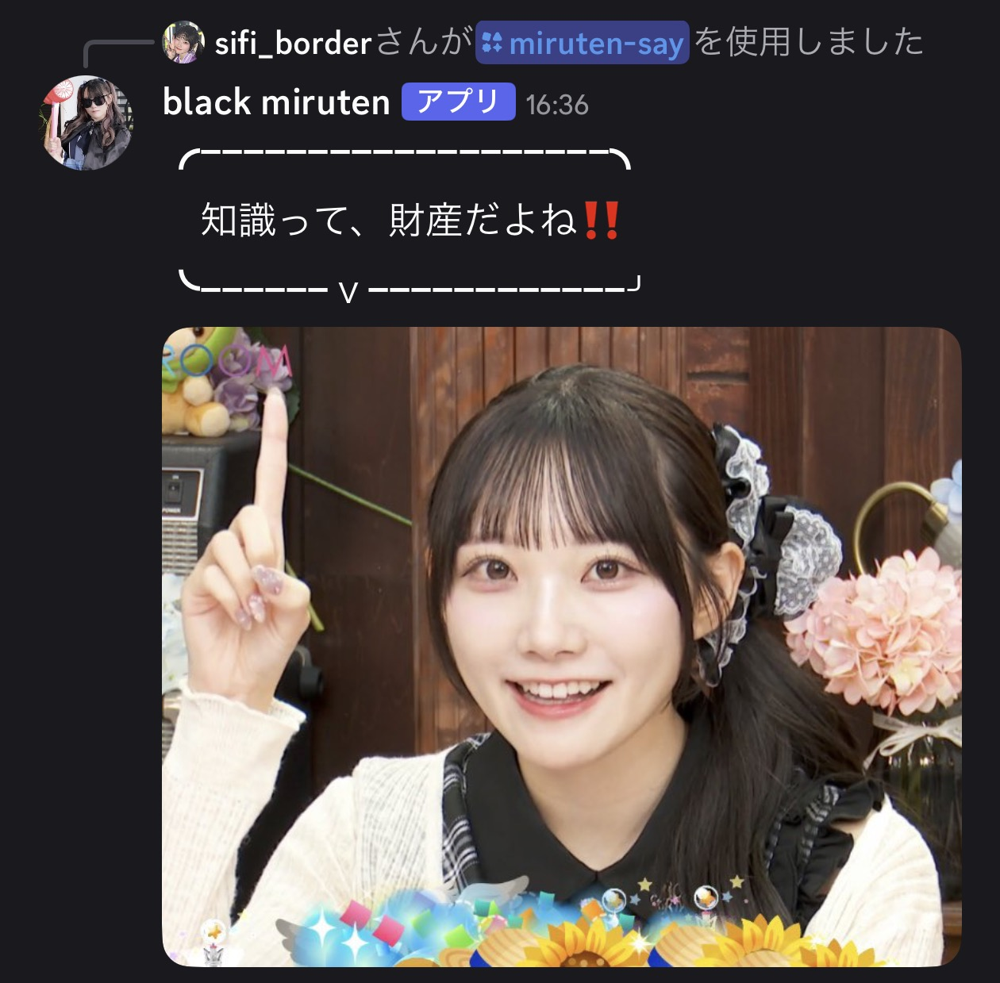

# `/miruten-say`

メッセージを罫線囲みの吹き出しに整形し、固定画像を添付して投稿します。



## 画像の差し替え

`assets/images/character.png` はプレースホルダー画像です。実際に添付したいキャラクター画像に差し替えてください。
画像のパスは `src/config/images.ts` で管理しており、コード中にはハードコードしていません。

```typescript
export const DEFAULT_IMAGE_ID = "default";

export const BUBBLE_IMAGES: BubbleImageConfig[] = [
  { id: "default", label: "デフォルト", path: "assets/images/character.png" },
];
```

画像を増やす場合は `BUBBLE_IMAGES` にエントリを追加し、`src/commands/miruten-say.ts` に `image` という文字列選択肢オプション(`addStringOption` + `addChoices`)を追加、
`getImageById(選ばれたid)` を呼ぶように変更するだけで対応できます。

## 罫線幅の計算ロジックについて

- 表示幅は全角(Unicode East Asian Width の Wide/Fullwidth 相当)を2、それ以外を1、結合文字・異体字セレクタを0として計算します。
- 上部罫線の `━` 本数は、メッセージの表示幅(複数行の場合は最大値)から2を引いた値(最低1本)としています。
- 下部罫線の `ｖ` は先頭から6本目の `━` の位置に固定し、罫線幅がそれより短い極端なケースでは収まる範囲に丸めます。
- この計算式は、仕様に示された例文 `知識って、財産だよね‼️` から実際の罫線幅を逆算し、一致するように検証済みです。
